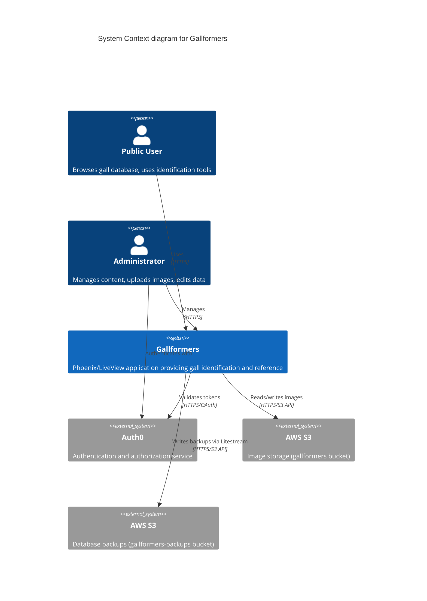

# C1: System Context Diagram

This diagram shows Gallformers as a system and its external dependencies.

## Key External Systems

- **Auth0**: Provides OAuth authentication for administrators
- **AWS S3 (gallformers)**: Stores all images referenced by the application
- **AWS S3 (gallformers-backups)**: Stores continuous database backups via Litestream

## Users

- **Public Users**: Can browse all content, search, use identification tools (no login required)
- **Administrators**: Can edit content, upload images, manage data (requires Auth0 login)
