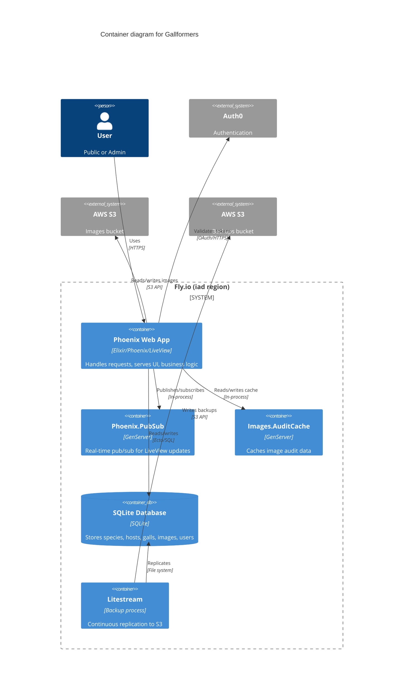

# C2: Container Diagram

This diagram shows the major runtime containers within the Gallformers system.

## Key Containers

### Phoenix Web Application
The main Elixir/Phoenix application that:
- Serves HTTP requests and LiveView connections
- Contains all business logic (Phoenix contexts)
- Handles authentication and authorization
- Manages image uploads to S3

### SQLite Database
Single-file database (`/data/gallformers.sqlite`) on persistent Fly.io volume that stores:
- Species, hosts, galls, taxonomy
- Images metadata (URLs point to S3)
- User accounts and sessions
- Articles, glossaries, sources

### GenServers

- **Phoenix.PubSub**: Enables real-time updates between LiveViews (e.g., admin changes broadcast to other admins)
- **Images.AuditCache**: Caches image audit data for orphan detection to avoid repeated S3 API calls

### Litestream
Runs alongside Phoenix on the same Fly.io machine, providing:
- Continuous replication of SQLite WAL to S3
- Point-in-time recovery capability
- Sub-second RPO (recovery point objective)

## Infrastructure

All containers run on a single Fly.io machine in the `iad` (US East) region with:
- Persistent volume mounted at `/data` for SQLite database
- Direct connection to AWS S3 in `us-east-1` (same region)
