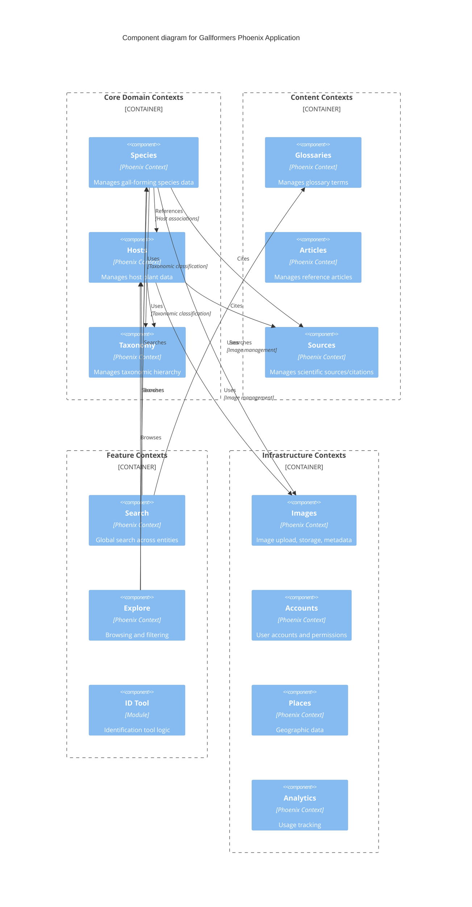

# C3: Component Diagram

This diagram shows the major Phoenix contexts within the application and their key relationships.

## Component Groups

These contexts are grouped visually for readability, but they are all peers in the domain layer. Each context encapsulates its own data model, business logic, and API.

### Core Domain Contexts
The heart of Gallformers - representing the biological entities:

- **Species**: Gall-forming organisms (insects, mites, etc.)
- **Hosts**: Plants that galls form on
- **Taxonomy**: Biological classification hierarchy (kingdom → phylum → class → order → family → genus → species)

### Content Contexts
Educational and reference content:

- **Glossaries**: Technical terms and definitions
- **Articles**: In-depth reference articles
- **Sources**: Scientific papers, books, and citations

### Feature Contexts
User-facing functionality:

- **Search**: Global search across species, hosts, glossaries
- **Explore**: Browsing and filtering capabilities
- **ID Tool**: Interactive gall identification tool

### Infrastructure Contexts
Cross-cutting technical concerns:

- **Images**: Image upload, storage (S3), metadata, orphan detection
- **Accounts**: User authentication (Auth0), authorization, profiles
- **Places**: Geographic data (states, counties, ranges)
- **Analytics**: Usage tracking and metrics

## Key Relationships

The diagram shows only the major relationships to keep it readable:

- Core domain contexts use **Taxonomy** for classification
- Core domain contexts use **Images** for photos
- Core domain contexts cite **Sources** for scientific backing
- Feature contexts query core domain contexts
- Infrastructure contexts are used by many others (cross-cutting)

## Context Isolation

Each context maintains strong boundaries:
- Owns its database tables/schemas
- Exposes a public API (functions in the context module)
- Other contexts call the API, never query schemas directly
- Changes within a context don't affect others (as long as the API stays stable)
