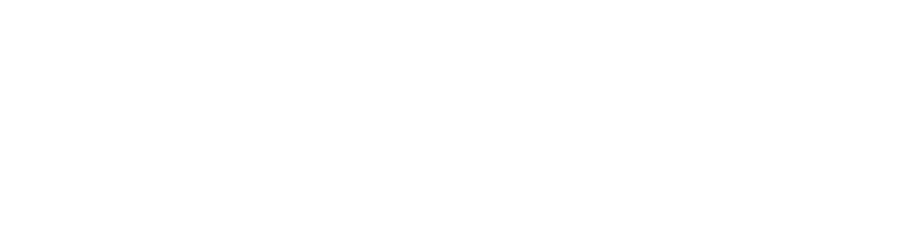
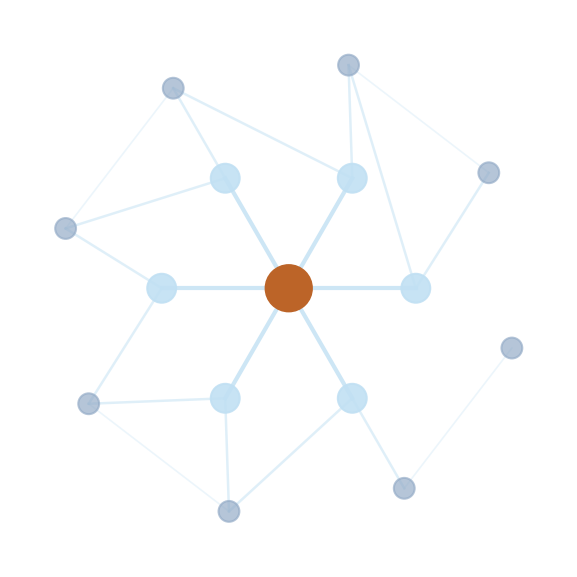

<!-- _class: cover -->

From reference to community.
February 13, 2026

---

<!-- _class: bignum -->

# ~100 → 3,670

We launched in May 2021 with roughly 100 species.
Today: 3,670 gall-forming species across 86 families and 376 genera. 1,455 undescribed taxa. 6,500+ images.

---

<!-- _class: statement -->

# The old tech was holding us back.

Simpler, modern technology. Faster turnaround on features and fixes. After years of being constrained by the old stack, we can move again.

Safer and easier admin tools. Identification keys. Articles. Analytics. All shipped early 2026.

---

<!-- _class: dark -->

# Now we build the community.

The people passionate about galls. The ecological web with galls at its center.

---

<!-- _class: split -->

<h1>Before we grow</h1>

Making the platform safe to move fast on.

- **Identification keys**, active paper collaboration refining the best key viewer in the field
- **Admin onboarding**, lowering the barrier for new contributors
- **Audit trail**, full tracing of every data change
- **Preview environments** so others can test before we release

---

<!-- _class: hemisphere -->

# Expand to the entire Western Hemisphere.

Real community support exists for this. We expand our geographic model and rework our maps to encompass the whole hemisphere.

Then we integrate with iNaturalist for things like photos and range data. And we bring DNA barcode data into taxonomy.

---

<!-- _class: split -->

<h1>Gall associates</h1>

The biggest initiative on our roadmap.

- **Parasitoids, inquilines, nectar-feeding ants, predators**, modeling the full ecological web around each gall
- An enormous area of **active research** with new discoveries constantly
- From documenting individual galls to mapping **ecological networks**

---

<!-- _class: content -->

# And then

- **New mobile-first ID tool**, usable in the field without connectivity
- **Join the global data ecosystem**, GBIF, DarwinCore, Wikidata, citable DOIs
- **Open contribution pathways**, letting the community feed observations back in

What are we not seeing?

---

<!-- _class: cta -->

# We need your ideas.

What's missing?
What would make Gallformers more useful for your work?
Would you like to contribute as an admin, a regional expert, help with data entry, something else?

**https://forms.gle/JWLzwnSK6fWdY4z97**
